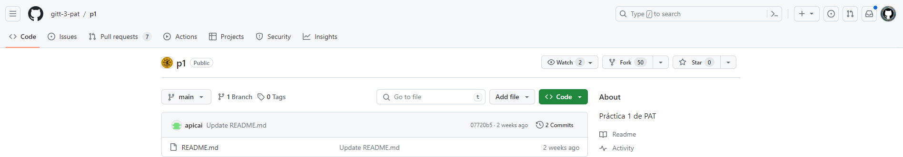

# Práctica 1:

**Autor:** Gonzalo de Alfonso Borrachero (201901076)

**Clase:** 3ºA GITT

## Fork:
Lo primero que he hecho es un fork fork sobre el [repositorio](https://github.com/gitt-3-pat/p1):

