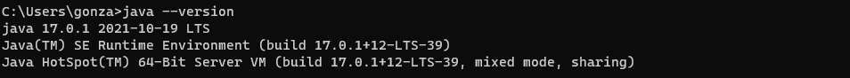
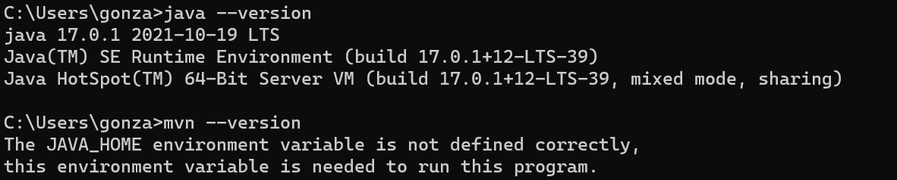
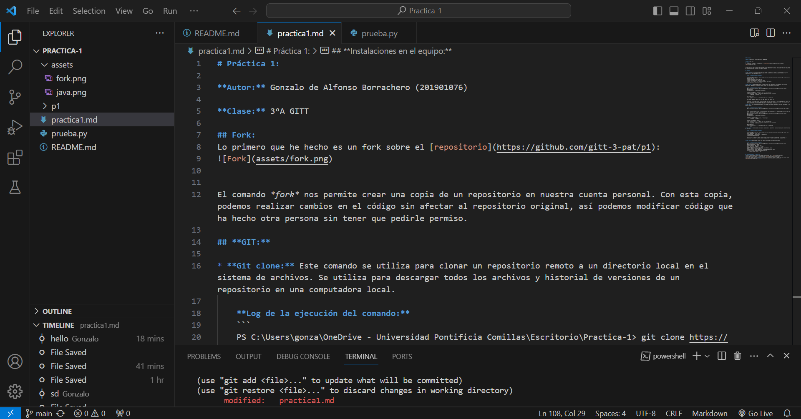
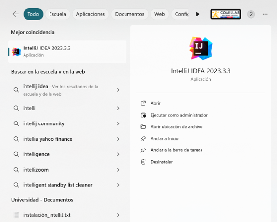

# Práctica 1:

**Autor:** Gonzalo de Alfonso Borrachero (201901076)

**Clase:** 3ºA GITT

## Fork:
Lo primero que he hecho es un fork sobre el [repositorio](https://github.com/gitt-3-pat/p1):


El comando *fork* nos permite crear una copia de un repositorio en nuestra cuenta personal. Con esta copia, podemos realizar cambios en el código sin afectar al repositorio original, así podemos modificar código que ha hecho otra persona sin tener que pedirle permiso.

## **GIT:**

* **Git clone:** Este comando se utiliza para clonar un repositorio remoto a un directorio local en el sistema de archivos. Se utiliza para descargar todos los archivos y historial de versiones de un repositorio en una computadora local.

    **Log de la ejecución del comando:**
    ```
    PS C:\Users\gonza\OneDrive - Universidad Pontificia Comillas\Escritorio\Practica-1> git clone https://github.com/gitt-3-pat/p1
    Cloning into 'p1'...
    remote: Enumerating objects: 6, done.
    remote: Counting objects: 100% (1/1), done.
    remote: Total 6 (delta 0), reused 0 (delta 0), pack-reused 5
    Receiving objects: 100% (6/6), done.
    ```

* **Git status:** Este comando muestra el estado actual del repositorio local. Muestra los archivos modificados, agregados o eliminados que aún no han sido rastreados o confirmados.

    **Log de la ejecución del comando:**
    ```
    PS C:\Users\gonza\OneDrive - Universidad Pontificia Comillas\Escritorio\Practica-1> git status
    On branch main
    Your branch is up to date with 'origin/main'.

    Changes not staged for commit:
    (use "git add <file>..." to update what will be committed)
    (use "git restore <file>..." to discard changes in working directory)
            modified:   practica1.md

    Untracked files:
    (use "git add <file>..." to include in what will be committed)
            p1/

    no changes added to commit (use "git add" and/or "git commit -a")
    ```

* **Git add:** Este comando agrega archivos al área de stage, donde se preparan para ser confirmados en el próximo commit.
    
    **Log de la ejecución del comando:**
    ```
    PS C:\Users\gonza\OneDrive - Universidad Pontificia Comillas\Escritorio\Practica-1> git add prueba.py

    ```
    Hemos hecho un add del archivo que hemos modificado y ahora si hacemos un git status, vemos que ahora aparecen como Changes to be committed:
    ```
    PS C:\Users\gonza\OneDrive - Universidad Pontificia Comillas\Escritorio\Practica-1> git status
    On branch main
    Your branch is up to date with 'origin/main'.

    Changes to be committed:
    (use "git restore --staged <file>..." to unstage)
            new file:   prueba.py

    Changes not staged for commit:
    (use "git add <file>..." to update what will be committed)
    (use "git restore <file>..." to discard changes in working directory)
            modified:   practica1.md

    Untracked files:
    (use "git add <file>..." to include in what will be committed)
            p1/
    ```
* **Git commit:** Este comando confirma los cambios en el repositorio local y crea un punto en el historial de versiones.
    
    **Log de la ejecución del comando:**
    ```
    PS C:\Users\gonza\OneDrive - Universidad Pontificia Comillas\Escritorio\Practica-1> git commit -m "Mi primer commit"               
    [main 97f2f8b] Mi primer commit
    1 file changed, 0 insertions(+), 0 deletions(-)
    create mode 100644 prueba.py
    ```
    En este caso he hecho un commit con el mensaje "Mi primer commit". Como vemos en el log, se ha modificado un archivo, no se ha añadido ninguna línea y tampoco se ha borrado ninguna línea.


* **Git push:** Este comando enviará los cambios confirmados al repositorio remoto.
        
    **Log de la ejecución del comando:**
    ```
    PS C:\Users\gonza\OneDrive - Universidad Pontificia Comillas\Escritorio\Practica-1> git push
    Enumerating objects: 5, done.
    Counting objects: 100% (5/5), done.
    Delta compression using up to 4 threads
    Compressing objects: 100% (3/3), done.
    Writing objects: 100% (3/3), 290 bytes | 290.00 KiB/s, done.
    Total 3 (delta 1), reused 0 (delta 0)
    remote: Resolving deltas: 100% (1/1), completed with 1 local object.
    To https://github.com/GonzaloIcai/Practica-1.git
        ef98414..45518ff  main -> main
    ```


## **Instalaciones en el equipo:**
* Java 17: El año pasado en la clase de POO ya instalamos Java.  
* Maven: La instalacion de maven la he realizado mediante su página web. Tengo descargado java y también he descomprimido el archivo .zip de maven y he seguido todas las indicaciones pero no he sido capaz de que funcione correctamente. 
* Editor de código fuente (**VsCode**): Visual Studio Code es el editor de código que llevo usando desde hace muchos años tanto como para programar como para escribir documentos en Markdown.

* Editor de código fuente (**IntelliJ Idea**):

